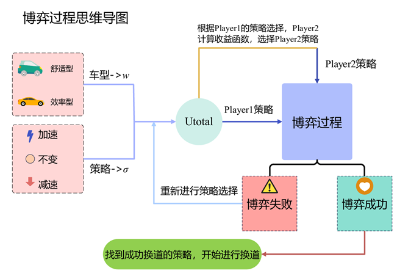

# SmartLaneChanging
This repository contains the Python implementation for our game theory group project on lane-changing in autonomous vehicles.

  


## Description

This script implements a game theory approach to the lane-changing problem for autonomous vehicles. The main goal is to optimize lane-changing decisions based on game theory strategies.

## How to Run the Script

### Prerequisites

- Ensure you have installed the necessary Python libraries (e.g., `argparse`, `json`) and the `players` module which defines the `Player1` and `Player2` classes.
- Make sure you have the parameters file (e.g., `setting舒适_效率.json`) ready, containing the required configuration data. The file should have a structure similar to:

  ```json
  {
      "player1": { /* parameters for player1 */ },
      "player2": { /* parameters for player2 */ }
  }

### Running the Script

1.Open Terminal:
Open your terminal (command line) and navigate to the directory where the script is located.

2.Execute the Script:
Run the following command:
```bash
python lane_changing_game.py --para_path [path_to_setting_file] \
--v1 [velocity of player1] --v2 [velocity of player2] \
--a1_min [minimum acceleration of player1] \
--a1_max [maximum acceleration of player1] \
--a2_min [minimum acceleration of player2] \
--a2_max [maximum acceleration of player2] \
--type1 [type of player1] --type2 [type of player2] \
--t [changing time] --l [length of player2]
```

After running the script, it will compute lane-changing decisions based on the game theory model and output relevant information.
